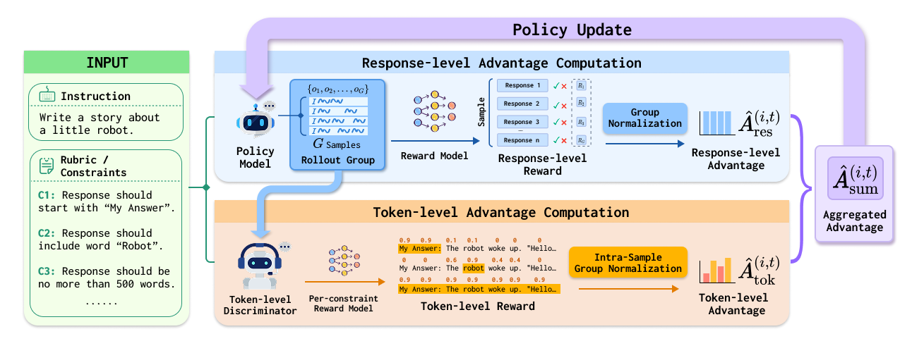

<div align='center'>
<h2>Rubrics to Tokens: Bridging Response-level Rubrics and <br> Token-level Rewards in Instruction Following Tasks</h2>


[](https://arxiv.org/abs/2604.02795)
</div>

## Updates

- **2026-04-09**: Added the training framework for the Token-Level Relevance Discriminator, built on [OpenRLHF](https://github.com/OpenRLHF/OpenRLHF). See [`OpenRLHF/README_TOKEN_LEVEL_VALUE.md`](./OpenRLHF/README_TOKEN_LEVEL_VALUE.md) for details.

## Overview

**Rubric-based Reinforcement Learning (RL)** has emerged as a promising approach for aligning LLMs with complex, open-domain instruction following tasks. However, existing methods predominantly rely on response-level rewards, which suffer from two fundamental problems: **reward sparsity** (binary all-or-nothing rewards leave the model without meaningful gradient signals when it cannot satisfy all constraints) and **reward ambiguity** (aggregated rewards fail to distinguish which tokens are responsible for constraint violations).

We propose **Rubrics to Tokens (RTT)**, a novel rubric-based RL framework that bridges coarse response-level scores and fine-grained token-level credit assignment. RTT is grounded in a straightforward hypothesis: for any specific constraint, only a subset of tokens plays a critical role in its satisfaction or violation. By introducing a **Token-Level Relevance Discriminator**, RTT predicts which tokens are responsible for each constraint and optimizes the policy via **RTT-GRPO**, which integrates response-level and token-level advantages within a unified framework. We further identify the **Group Partitioning Problem**, a normalization design challenge arising when transitioning from one-dimensional outcome rewards to a three-dimensional token-level rubric reward space, and propose **Intra-sample Token Group Normalization** to address it. Extensive experiments demonstrate that RTT consistently outperforms all baselines in both instruction-level and rubric-level accuracy across multiple models and benchmarks, while preserving general capabilities.



## Quick Start

### Prerequisites

- Python 3.10+
- Multi-GPU environment

### Installation

```bash
conda create -n rtt python=3.10 -y
conda activate rtt

pip install -r requirements_torch260_vllm.txt
```

### Running the Pipeline

```bash
# Qwen3-4B
bash examples/rubrics2tokens/run_rubric2token_pipeline_qwen3.sh

# Qwen2.5-7B
bash examples/rubrics2tokens/run_rubric2token_pipeline_qwen25.sh

# LLaMA-3.2-3B
bash examples/rubrics2tokens/run_rubric2token_pipeline_llama.sh
```

### Configuration

Each script invokes the corresponding YAML config under `examples/rubrics2tokens/`. Key parameters:

| Parameter | Description | Default |
|---|---|---|
| `pretrain` | Policy model path | e.g. `Qwen/Qwen3-4B-Instruct-2507` |
| `reward_pretrain` | LLM judge model path | `deepseek-ai/DeepSeek-V3.1` |
| `discriminator_pretrain` | Token-level discriminator checkpoint | *To Be Added* |
| `rollout_batch_size` | Number of prompts per generation batch | `64` |
| `num_return_sequences_in_group` | Samples per prompt | `8` |
| `rubric_token_level_reward_method` | How to combine response & token advantages (`add` / `mix`) | `add` |
| `rubric_token_level_reward_weight` | Weight of token-level advantage | `0.5` |
| `rubric_norm_type` | Group normalization strategy for token-level rewards | `token_only_adv-rubrics_mean`(intra-sample group normalization) or `group_token_adv-rubrics_mean` (intra-sample group normalization) |
| `reward_union_type` | Reward aggregation strategy | `all-or-nothing`(AON) or `mean`(CSR) |
| `max_steps` | Total training steps | `500` |

You can also override any parameter from the command line:

```bash
python examples/start_rubrics2token_pipeline.py \
    --config_path rubrics2tokens \
    --config_name rubric2token_config_qwen3 \
    rollout_batch_size=128 max_steps=1000
```


## Acknowledgement

We thank [ROLL](https://github.com/alibaba/ROLL) for providing the efficient open-source distributed RL infrastructure that powers this work. We also thank the developers of [Qwen](https://github.com/QwenLM), [LLaMA](https://github.com/meta-llama), and [DeepSeek](https://github.com/deepseek-ai) for their outstanding open-source models.
